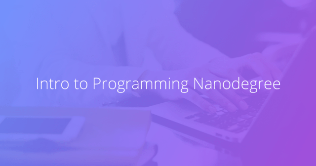

# Udacity Intro to Programming Nanodegree

 

**Course period: November 2017 – January 2018.**

 

Course content: HTML, CSS, Python incl. Object-Oriented programming and an introduction in data science using Jupyter notebook (NumPy, Pandas, Matplotlib and Seaborn).

 

------

*Last update: 31 August 2019*

